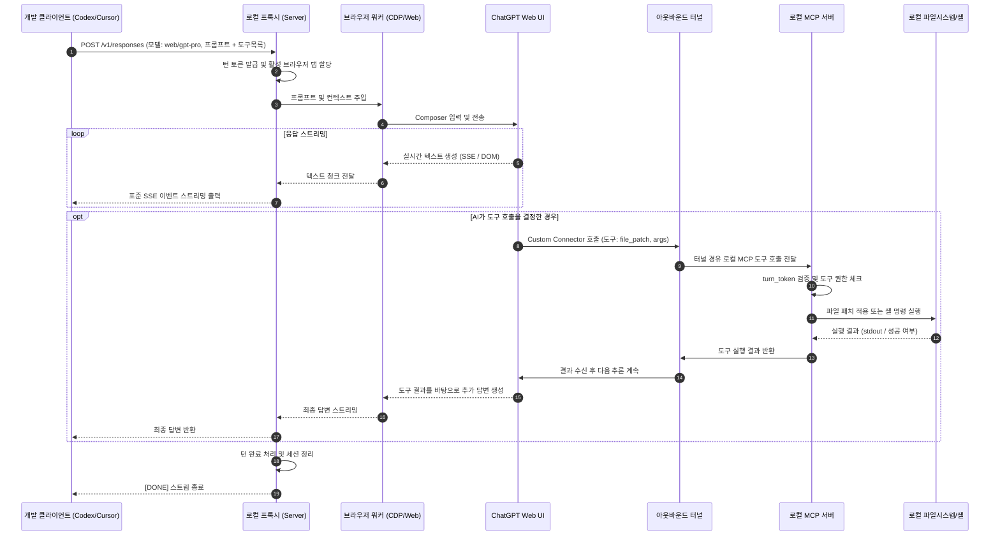

# 프로젝트 전면 재설계 아키텍처 문서 (From-Scratch Design)

> **프로젝트명**: Next-Gen Web-AI Agent Bridge (가칭 `web-agent-bridge`)  
> **문서 버전**: v1.0.0  
> **작성 일자**: 2026-09-18  
> **상태**: 승인 대기 (Draft)

---

## 1. 개요 및 재설계 배경

### 1.1 기존 시스템(`codex-chatgpt-web`)의 성과와 한계
기존 프로젝트는 **"소비자 웹 플랜(ChatGPT Plus/Pro)의 플래그십 모델을 API 과금 없이 로컬 Codex와 연결하고, 공식 MCP 터널을 통해 양방향 도구 실행(에이전트)을 달성"**하는 획기적인 성과를 거두었습니다.

그러나 초기 구현에서 파생된 다음과 같은 구조적 부채와 한계가 존재합니다:
1. **단일 거대 파일과 강한 결합**: `browser-worker.ts`(5,000+ 줄), `server.ts`(1,100+ 줄), `index.ts`(1,500+ 줄) 등 몇몇 파일에 수많은 책임(DOM 조작, 토큰 추정, 에러 복구, 상태 머신 등)이 엉켜 있어 유지보수 난이도가 높습니다.
2. **ChatGPT & Codex 전용 단일 플랫폼 종속**: Codex의 비공개 Responses API 스키마와 ChatGPT 웹 DOM 구조에 강하게 종속되어 있어, Claude Web, Gemini Web 등 타 AI 서비스나 Cursor, Aider, Roo Code 등 타 IDE 클라이언트로 확장하기 어렵습니다.
3. **Electron과 Playwright의 런타임 중복**: Electron 런처 내에 Playwright Chromium이 중복 구동되거나 프로세스 라이프사이클 관리가 복잡하여 메모리 소모가 크고 파일 락(Windows crashpad 등) 이슈가 빈번합니다.
4. **DOM 변경에 대한 취약성**: 웹 UI의 클래스명이나 레이아웃이 변경될 때마다 세밀한 셀렉터 조정이 필요합니다.

### 1.2 재설계 핵심 목표
- **Modular Micro-Kernel Architecture**: 코어 엔진(프록시 + 세션 관리 + MCP 브로커)과 프로바이더 어댑터(ChatGPT, Claude 등), 클라이언트 어댑터(OpenAI, Anthropic 등)를 완전 분리.
- **Client & Model Agnostic**: Codex뿐만 아니라 Cursor, Continue, Aider 등 표준 OpenAI API 호환 클라이언트를 모두 지원.
- **Resilient Automation**: DOM 단순 셀렉터 의존을 줄이고, CDP(Chrome DevTools Protocol) 네트워크 인터셉션 및 접근성 트리(Accessibility Tree) 기반의 견고한 브라우저 제어 도입.
- **Lightweight Single Runtime**: Electron 없이도 경량 Headless Chrome/Brave/Edge를 직접 제어 가능한 데몬 우선(Daemon-First) 구조 설계.
- **Zero-Trust Local Security**: 엄격한 루프백 격리, 동적 토큰 인증, 로컬 파일 시스템 변경 격리(Sandboxing).

---

## 2. 전체 시스템 아키텍처

시스템은 5개의 독립된 계층(Layer)으로 구성됩니다:

```text
┌─────────────────────────────────────────────────────────────────────────┐
│ [Layer 1] Client Interface Layer (API Gateways)                         │
│   - OpenAI v1 ChatCompletions & Responses API                           │
│   - Anthropic v1 Messages API                                           │
│   - Streaming SSE Engine & Model Catalog Synthesizer                    │
└────────────────────────────────────┬────────────────────────────────────┘
                                     │ 표준 요청/응답 변환
┌────────────────────────────────────▼────────────────────────────────────┐
│ [Layer 2] Core Orchestrator & Session Manager                           │
│   - Session Pool & Concurrency Limiter (Max N concurrent tabs)          │
│   - Context Window & Compaction Controller (Token Counter, Handoff)     │
│   - Turn Lifecycle & Interrupt Handler (AbortSignal, Cancellation)      │
└───────────────────┬─────────────────────────────────┬───────────────────┘
                    │ 턴 제어                         │ 도구 디스패치
┌───────────────────▼─────────────┐   ┌───────────────▼───────────────────┐
│ [Layer 3] Web Driver Engine     │   │ [Layer 4] Two-Way Agent Harness   │
│   - CDP-based Browser Controller│   │   - Outbound Secure Tunnel Client │
│   - Isolated Profile & Passkey  │   │   - Embedded MCP Server           │
│   - Network/DOM Stream Sniffer  │   │   - Local Sandbox Tool Executor   │
└───────────────────┬─────────────┘   └───────────────┬───────────────────┘
                    │                                 │
                    ▼                                 ▼
         ┌─────────────────────┐           ┌─────────────────────┐
         │ ChatGPT / Claude Web│ ◄═══════► │ Cloud Connector     │
         │ (Web Browser Tab)   │  MCP 호출 │ (OpenAI/Custom MCP) │
         └─────────────────────┘           └─────────────────────┘
```

---

## 3. 계층별 상세 설계

### 3.1 Layer 1: 클라이언트 인터페이스 (Client Interface)
- **표준 API 에뮬레이션**:
  - `GET /v1/models`: 업스트림 공식 모델 목록과 가상 웹 모델(`web/gpt-5-sol`, `web/claude-3-7-sonnet` 등)을 실시간 합성하여 제공.
  - `POST /v1/chat/completions` 및 `POST /v1/responses`: 스트리밍 SSE(`text/event-stream`)를 기본 제공하며, 클라이언트의 중단(Client disconnect/abort)을 즉시 하위 계층으로 전파.
- **요청 정규화(Request Normalization)**:
  - 클라이언트마다 다른 도구 정의(`tools`, `functions`) 및 컨텍스트 포맷을 내부 표준 `TurnRequest` 인터페이스로 통일.

### 3.2 Layer 2: 코어 오케스트레이터 (Core Orchestrator)
- **동시성 및 세션 풀(Session Pool)**:
  - 계정 제재(Rate limit / Abuse detection)를 회피하기 위해 활성 브라우저 탭 수를 엄격히 제한(기본 3~5개).
  - 작업(Thread) 단위로 브라우저 탭을 매핑하여 대화 연속성을 유지하고, 유휴 세션은 LRU 정책으로 정리.
- **컨텍스트 컴팩션(Compaction) 엔진**:
  - 토큰 추정기(Tiktoken/GPT-5 토크나이저)를 통해 컨텍스트 크기가 웹 입력창 한계(예: 32k~128k)에 근접하면, 자동으로 요약 프롬프트를 전송하여 체크포인트를 생성하고 신규 임시 채팅으로 세션을 교체.

### 3.3 Layer 3: 웹 드라이버 엔진 (Web Driver Engine)
- **CDP(Chrome DevTools Protocol) 기반 경량 자동화**:
  - 무거운 Playwright 번들 대신 경량 CDP 라이브러리(`puppeteer-core` 또는 네이티브 WebSocket CDP 클라이언트)를 사용하여 시스템에 이미 설치된 Chrome/Edge/Brave 프로세스를 디버깅 포트로 연결.
- **하이브리드 스트림 캡처 (Network Interception + DOM Fallback)**:
  - 브라우저 내부의 Fetch/WebSocket 트래픽을 CDP 네트워크 도메인에서 직접 인터셉트하여 원본 청크(Chunk)를 캡처(DOM 렌더링 딜레이 제거 및 100% 원문 정확도 확보).
  - 네트워크 패킷 암호화 등으로 불가능할 때만 DOM MutationObserver를 이용한 스트리밍 캡처로 폴백.
- **패스키 & 세션 격리**:
  - 사용자의 일상 브라우저 프로필을 건드리지 않고, 임시 디렉토리에 격리된 유저 데이터(`temp-profile`)를 생성하여 로그인 쿠키만 안전하게 추출/저장(`0600` 권한).

### 3.4 Layer 4: 양방향 에이전트 하네스 (Two-Way Agent Harness)
- **아웃바운드 터널 매니저**:
  - OpenAI Tunnel Client 바이너리를 플랫폼별(Windows, macOS, Linux)로 자동 다운로드/해시 검증 후 데몬 서브프로세스로 관리.
  - Cloudflare Tunnel이나 로컬 프라이빗 릴레이로 손쉽게 교체 가능한 추상 인터페이스(`TunnelProvider`) 도입.
- **로컬 MCP 서버 (Model Context Protocol)**:
  - 표준 `@modelcontextprotocol/sdk` 기반으로 파일 읽기/쓰기, diff 패치 적용, 터미널 실행, 프로젝트 검색 등의 도구를 ChatGPT 커넥터에 노출.
  - 턴별 암호화 토큰(`turn_token`)을 검증하여, 현재 활성화된 턴에서 발생한 정당한 도구 호출만 로컬에서 실행.
- **로컬 실행 샌드박스**:
  - 터미널 명령어 실행 시 작업 디렉토리(CWD) 탈출 방지 및 위험 명령(예: `rm -rf /`, 시스템 설정 변경) 사전 차단 정책 적용.

---

## 4. 데이터 흐름 및 시퀀스 다이어그램



---

## 5. 핵심 인터페이스 및 데이터 모델 정의 (TypeScript)

### 5.1 드라이버 어댑터 인터페이스
```typescript
export interface WebAiDriver {
  readonly id: string; // 'chatgpt' | 'claude' | 'gemini'
  readonly name: string;
  
  initialize(options: DriverInitOptions): Promise<void>;
  checkAuthentication(): Promise<AuthStatus>;
  
  startTurn(request: NormalizedTurnRequest, signal: AbortSignal): Promise<TurnExecutionStream>;
  abortTurn(turnId: string, reason: string): Promise<void>;
  
  compactContext(history: Message[]): Promise<CompactedHistory>;
  dispose(): Promise<void>;
}

export interface TurnExecutionStream {
  readonly turnId: string;
  readonly textStream: AsyncIterable<string>;
  readonly thinkingStream?: AsyncIterable<string>;
  waitForCompletion(): Promise<TurnCompletionReport>;
}
```

### 5.2 도구 및 MCP 계약 인터페이스
```typescript
export interface LocalToolDefinition {
  name: string;
  description: string;
  parameters: Record<string, unknown>; // JSON Schema
  requiresConfirmation?: boolean;
  execute(args: Record<string, unknown>, context: ToolExecutionContext): Promise<ToolResult>;
}

export interface ToolExecutionContext {
  workspaceRoot: string;
  turnToken: string;
  signal: AbortSignal;
  log(message: string): void;
}
```

---

## 6. 재설계 시 개선되는 핵심 아키텍처적 차이점

| 비교 항목 | 기존 구현 (`codex-chatgpt-web`) | 신규 설계 (`web-agent-bridge`) |
| :--- | :--- | :--- |
| **타겟 클라이언트** | OpenAI Codex (CLI / Desktop) 전용 | Codex, Cursor, Continue, Aider 등 **모든 OpenAI 호환 도구** |
| **지원 AI 웹** | ChatGPT Web 단일 지원 | ChatGPT, Claude, Gemini를 플러그인 형태로 수용하는 **멀티 어댑터** |
| **브라우저 런타임** | Electron + Playwright Chromium 복합 | **Headless Chrome/Edge 직접 제어 (CDP 기반)**, Electron 의존성 제거 |
| **스트리밍 캡처** | DOM 폴링 및 MutationObserver 의존 | **CDP 네트워크 이벤트 인터셉트 우선** + DOM 폴백 |
| **코드베이스 구조** | 5,000줄 이상의 모놀리식 파일 다수 존재 | 도메인 주도(DDD) 및 클린 아키텍처 기반의 **단일 책임 모듈 분리** |
| **도구 보안** | 기본 파일 수정 및 셸 실행 허용 | **작업 디렉토리 샌드박싱**, 위험 명령어 사전 필터링, 화이트리스트 정책 |

---

## 7. 단계별 구현 마일스톤 (Roadmap)

1. **M1: 코어 프록시 & CDP 드라이버 베이스라인 (2주)**
   - Bun 기반 `/v1/models`, `/v1/chat/completions` 스트리밍 서버 구축.
   - 로컬 Chrome과 CDP 연결 및 ChatGPT Web 텍스트 송수신/스트리밍 캡처 검증.
2. **M2: 아웃바운드 MCP 터널 & 도구 실행 통합 (2주)**
   - OpenAI Tunnel 클라이언트 라이프사이클 관리자 구현.
   - 로컬 파일 시스템 및 셸 실행 MCP 서버 연동 (Full Agent 루프 완성).
3. **M3: 멀티 클라이언트 & 멀티 프로바이더 확장 (2주)**
   - Claude Web 어댑터 추가 (Claude Sonnet 3.7 연동).
   - Cursor / Continue / Aider 연동 테스트 및 호환성 보장.
4. **M4: 안정화 & 배포 패키징 (1주)**
   - Windows, macOS, Linux 크로스 플랫폼 CLI 배포 바이너리 패키징.
   - 자동 복구, 세션 만료 알림, 헬스체크 및 닥터 CLI 완성.
