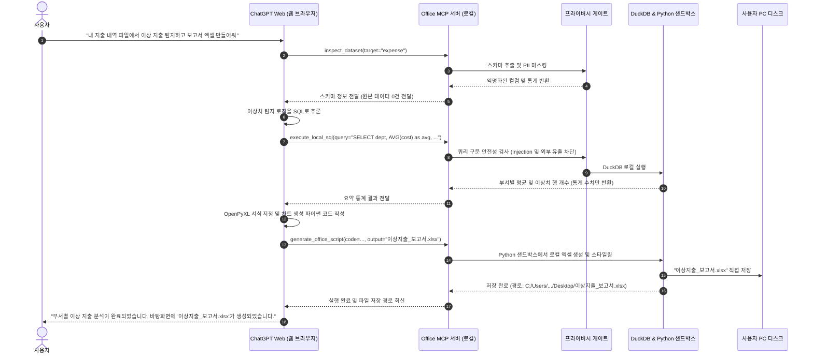

# 로컬 데이터 프라이버시 보장 사무 자동화 설계 문서 (Local-Privacy Office Operator)

> **프로젝트명**: Web-GPT Office Operator (가칭 `office-operator`)  
> **문서 버전**: v1.0.0  
> **작성 일자**: 2026-09-18  
> **상태**: 승인 대기 (Draft)  
> **기반 기술**: `codex-chatgpt-web`의 아웃바운드 MCP 터널 및 브라우저 브릿지 아키텍처

---

## 1. 배경 및 설계 목표

### 1.1 해결하고자 하는 문제 (Problem Statement)
- **클라우드 데이터 유출 위험**: ChatGPT, Claude 등 상용 LLM에 회사 재무 데이터, 고객 개인정보(PII), 급여 내역, 내부 기밀 계약서가 포함된 엑셀/CSV를 그대로 업로드하면 기업 보안 규정(GDPR, 개인정보보호법, 사내 보안 지침)을 위반하게 됩니다.
- **고비용 API의 한계**: 고용량 엑셀 데이터를 유료 API로 전송할 경우 천문학적인 토큰 비용이 발생합니다.
- **단순 챗봇의 실행력 부족**: 일반적인 웹 챗봇은 조언만 제공할 뿐, 사용자의 PC에 있는 실제 엑셀 서식을 유지하며 수식을 적용하거나 피벗 테이블을 생성하여 저장하는 작업을 직접 수행하지 못합니다.

### 1.2 핵심 설계 원칙 (Design Principles)
1. **Zero Raw-Data Transmission (원본 데이터 비전송 원칙)**:
   - 어떠한 경우에도 로컬의 원본 로우 데이터(Raw Rows)를 외부 LLM으로 전송하지 않습니다.
   - LLM에는 오직 **스키마(컬럼명, 데이터 타입)**와 **가명화된 더미 샘플(1~2행)**만 제공됩니다.
2. **Code-over-Data (데이터 대신 코드 이동)**:
   - LLM은 데이터를 직접 가공하는 대신, 데이터를 가공할 **SQL 쿼리** 또는 **Python/Pandas 스크립트**를 작성합니다.
   - 실제 데이터 연산은 100% 사용자의 로컬 머신(DuckDB/Python 샌드박스)에서 격리되어 수행됩니다.
3. **Local Result Synthesis (결과의 로컬 완결성)**:
   - 최종 생성물(가공된 엑셀 파일, 고해상도 차트 이미지, PDF 보고서)은 로컬 디스크에 직접 저장되며, LLM에는 작업 성공 여부와 요약 통계 지표(Aggregated Metrics)만 회신됩니다.

---

## 2. 전체 시스템 아키텍처

```mermaid
flowchart TD
    subgraph Cloud["외부 클라우드 (OpenAI / Web AI)"]
        WebChatGPT["ChatGPT Web\n(플래그십 모델 / Deep Research)"]
        TunnelHub["OpenAI Secure Tunnel"]
    end

    subgraph UserPC["사용자 로컬 PC (완전 격리 구역)"]
        direction TB
        
        subgraph BridgeLayer["브릿지 & 터널 계층"]
            TunnelClient["아웃바운드 터널 클라이언트\n(openai/tunnel-client)"]
            MCPServer["Office MCP 서버"]
        end

        subgraph PrivacyGate["프라이버시 게이트 (Privacy Gateway)"]
            SchemaExtractor["스키마 추출 & 익명화 엔진\n(PII 마스킹, 더미 생성)"]
            PolicyValidator["코드/쿼리 보안 검증기\n(네트워크 차단, 파일 탈출 방지)"]
        end

        subgraph ExecutionEngine["로컬 연산 샌드박스"]
            DuckDBEngine["초고속 로컬 SQL 엔진\n(DuckDB / SQLite)"]
            PythonSandbox["로컬 데이터 처리기\n(Pandas / OpenPyXL / Matplotlib)"]
        end

        subgraph Storage["로컬 저장소"]
            RawData[("원본 파일\n.xlsx / .csv / .db")]
            OutFiles[("결과물 생성\n정리된 .xlsx / 차트 .png")]
            AuditLog[("감사 로그 (Audit Log)\n실행된 쿼리 및 해시 기록")]
        end
    end

    WebChatGPT <-->|"1. MCP 도구 호출 및 결과 반환"| TunnelHub
    TunnelHub <-->|"2. 암호화 아웃바운드 터널"| TunnelClient
    TunnelClient <--> MCPServer

    MCPServer -->|"3. 데이터 구조 요청"| SchemaExtractor
    SchemaExtractor -->|"4. 메타데이터만 읽기"| RawData
    SchemaExtractor --."5. 마스킹된 스키마만 전달".-> MCPServer

    MCPServer -->|"6. 생성된 SQL/코드 검증"| PolicyValidator
    PolicyValidator -->|"7. 안전한 연산 실행"| ExecutionEngine
    
    DuckDBEngine <--> RawData
    PythonSandbox <--> RawData
    PythonSandbox -->|"8. 로컬 파일 직접 저장"| OutFiles
    PolicyValidator -->|"9. 감사 기록 저장"| AuditLog
```

---

## 3. 핵심 프라이버시 보호 메커니즘

### 3.1 PII 마스킹 및 스키마 가상화 (Schema Anonymization)
사용자가 `sales_2026_q1.xlsx` 파일을 지정했을 때, 시스템은 다음과 같이 원본을 철저히 차단하고 구조 정보만 추출합니다:

- **원본 데이터 (로컬 보관)**:
  | 주민등록번호 | 고객명 | 카드번호 | 결제금액 | 결제일시 |
  | :--- | :--- | :--- | :--- | :--- |
  | 880101-1234567 | 홍길동 | 1234-5678-9012-3456 | 1,250,000 | 2026-03-01 14:20:11 |

- **LLM에게 전달되는 가상화 스키마 (외부 전송)**:
  ```json
  {
    "file_id": "file_a7f9",
    "table_name": "sales",
    "row_count": 54200,
    "columns": [
      { "name": "customer_id", "type": "STRING", "pii_type": "RESIDENT_ID", "sample": "******-*******" },
      { "name": "customer_name", "type": "STRING", "pii_type": "PERSON_NAME", "sample": "ANON_USER_A" },
      { "name": "card_number", "type": "STRING", "pii_type": "CREDIT_CARD", "sample": "****-****-****-****" },
      { "name": "amount", "type": "INTEGER", "min": 1000, "max": 5000000 },
      { "name": "payment_date", "type": "TIMESTAMP" }
    ]
  }
  ```

### 3.2 로컬 샌드박스 실행 엔진 (Local Sandbox Execution)
1. **DuckDB 엔진**:
   - 엑셀 및 CSV를 메모리/로컬 임시 DB에 즉각 마운트하여 수백만 행도 수 밀리초 만에 집계(SQL).
   - `SELECT`, `GROUP BY`, `WINDOW` 연산에 최적화.
2. **격리된 Python 프로세스 (OpenPyXL / Pandas)**:
   - 복잡한 엑셀 서식 지정(조건부 서식, 폰트, 테두리, 수식 삽입), 피벗 테이블 생성, Matplotlib 차트 생성 담당.
   - **샌드박스 정책**: 외부 네트워크 소켓 생성 금지(`AF_INET` 차단), 지정된 작업 디렉토리 외 파일 시스템 접근 금지.

---

## 4. MCP 도구 명세 (Tool Specifications)

Office Operator MCP 서버는 ChatGPT에 다음 5가지 표준 도구만 제공합니다:

### 4.1 `inspect_dataset`
- **역할**: 지정된 로컬 파일(엑셀, CSV, DB)의 스키마와 데이터 통계 요약만 조회.
- **인자**:
  - `target_alias`: 파일 별칭 (예: `monthly_expense`)
- **반환값**: 마스킹된 컬럼 정의, 총 행 수, 결측치 비율.

### 4.2 `execute_local_sql`
- **역할**: 로컬 DuckDB를 통해 데이터를 집계/필터링하고 **익명화된 통계 요약값만** 반환.
- **인자**:
  - `query`: 실행할 SQL 쿼리 (예: `SELECT department, SUM(amount) AS total, AVG(amount) FROM expense GROUP BY department`)
- **보안 제약**: `DROP`, `DELETE`, `UPDATE` 불가(Read-Only), 결과 반환 시 최대 20행 제한(대량 유출 방지).

### 4.3 `generate_office_script`
- **역할**: 엑셀 서식 편집, 수식 입력, 다중 시트 생성 등을 수행하는 Python/Node 스크립트 실행.
- **인자**:
  - `script_type`: `"pandas"` | `"openpyxl"`
  - `code`: 샌드박스 내부에서 실행될 파이썬 코드 블록
  - `output_filename`: 생성될 새 엑셀 파일명
- **반환값**: 파일 생성 성공 여부, 파일 크기, 로컬 저장 절대 경로.

### 4.4 `render_local_chart`
- **역할**: 집계된 데이터를 바탕으로 로컬에서 시각화 차트 이미지(`.png`) 생성.
- **인자**:
  - `chart_type`: `"bar"` | `"line"` | `"scatter"` | `"pie"`
  - `x_axis`, `y_axis`, `title`
  - `output_image_path`: 저장할 로컬 이미지 경로

---

## 5. 실제 업무 시나리오 흐름도 (End-to-End Workflow)

> **시나리오**: 회계팀 담당자가 10만 건의 개인정보 및 지출 내역이 담긴 `2026_q1_raw.xlsx`에서 **"부서별 이상 지출(평균 대비 3배 초과)을 탐지하고, 피벗 테이블과 차트가 포함된 최종 보고서 엑셀 파일을 만들어줘"**라고 지시한 경우.



---

## 6. 보안 및 규정 준수 (Compliance & Governance)

1. **완전한 네트워크 격리 (Network Isolation)**:
   - 샌드박스 연산 엔진은 호스트 머신의 루프백 및 아웃바운드 인터넷 접속이 전면 차단됩니다. 스크립트 내에 `requests`, `urllib`, `socket` 호출이 포함되면 구문 분석 단계에서 즉시 실행이 거부됩니다.
2. **감사 추적 로그 (Immutable Audit Trail)**:
   - 모든 도구 호출, 변환된 스키마, 실행된 SQL 쿼리, 생성된 파일의 SHA-256 해시가 로컬 SQLite(`audit.db`)에 영구 기록되어 사내 정보보안팀 감사에 증거로 제출될 수 있습니다.
3. **사용자 사전 승인(Confirmation Step) 옵션**:
   - 파일 쓰기(`generate_office_script`) 직전에 데스크톱 알림 또는 CLI 프롬프트를 통해 사용자에게 "이 스크립트를 로컬에서 실행하시겠습니까?" 팝업 확인을 거치도록 설정할 수 있습니다.

---

## 7. 기대 효과 및 도입 가치

- **완벽한 데이터 주권 확보**: 은행, 병원, 로펌, 대기업 등 기밀 데이터 유출 위험 때문에 상용 AI를 도입하지 못하던 조직에서 즉시 사용 가능.
- **비용 절감**: 기가바이트(GB) 단위의 대용량 엑셀/데이터베이스라도 LLM에는 몇 KB 미만의 메타데이터만 오가므로, 일반 웹 구독(ChatGPT Plus/Team/Pro) 한도만으로 대규모 분석 가능.
- **실제적인 업무 완결**: 단순 텍스트 답변이 아닌 실제 스타일이 적용된 완성형 엑셀 문서와 차트 파일이 내 컴퓨터에 바로 떨어지는 실용적인 자동화 달성.
